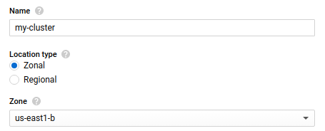
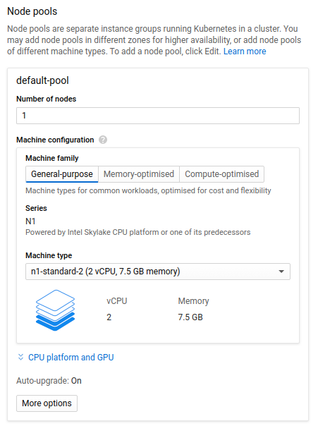

# Using Google Kubernetes Engine (GKE)

Google gives out $300 to let people test with their sistems and develop small scale applications.
However we can use this cash to run a remote Don't Starve Together dedicated server and play with friend from all over the globe.
Here is the link for more information [GKE](https://cloud.google.com/kubernetes/)

Suported variables will be in the [env section](kubernetes.yml#L36)

## Prerequisites

### Creating a cluster

An detailed tutorial can be found at [Google documentation](https://cloud.google.com/kubernetes-engine/) on how to create a cluster.

#### Recomandations

Create a cluster in zone us-east1-b, using location type Zonal.
As far as I can tell this is the cheapest zone and will let you play for longer.

Regarding the nodes(machines) that the server will be using the best one is n1-standard-2.
This has enough memmory to let 64 players play and enough CPU so that the server runs smothly.

**Important:** there is no need for more than 1 node, so set this accordingly.

### Creating the server

Afther configuring [kubernetes.yml](kubernetes.yml) file run `kubectl apply -f kubernetes.yml`.
This will create the server and the needed resources so that it can be played smoothly.

### Shuting down the server

There is two ways to shut down the server.

* Scale the server so that it requires 0 replicas, by using the command `kubectl scale --replicas=0 dont-starve-together-server`
* Scale the cluster to 0 machines, this will shut down the server before shuting down the machine.

It is recomendad to do both, first scale the server to 0, then scale the cluster.

### Restarting the server

Just scale back to the previous value based on which one you dediced in [Shuting down the server](README.md#L34)
